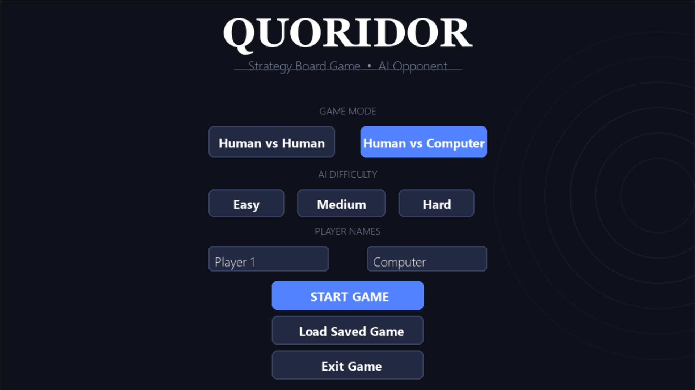
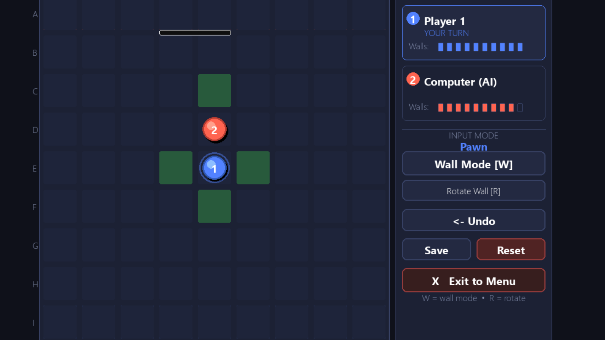
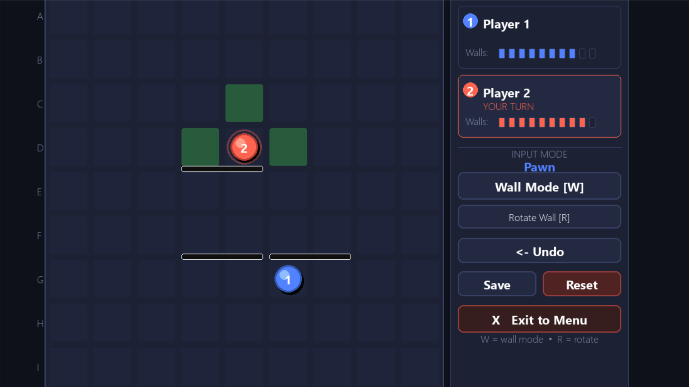
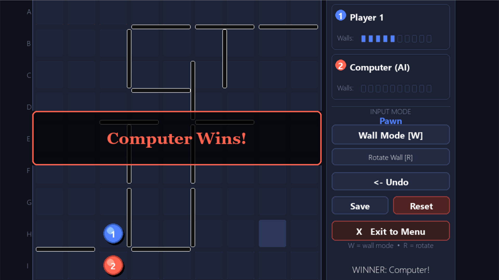
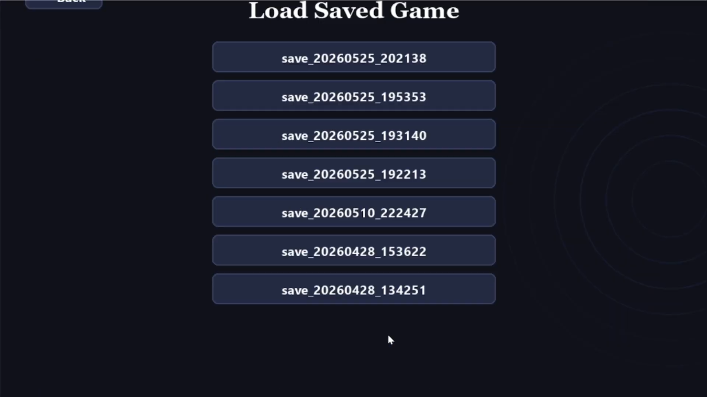

# Quoridor - CSE472s AI Project (Spring 2026)
 Ahmed Abdelghany Mohamed 2300215-Hossam Kamal ElSayed 2300715-Mohamed Khaled Mohamed Kamel 2300478
---

A complete implementation of the Quoridor strategy board game built with Python and Pygame.

---

## Game Description

Quoridor is a 2-player strategy game played on a 9×9 board. Each player moves a pawn from one side to the opposite side. Players can also place walls to block the opponent's path. The first player to reach the opposite side wins.

---

## Screenshots












---

## Installation & Running

### Prerequisites
- Python 3.8+
- pip

### Install dependencies
```bash
pip install pygame-ce
```

### Run the game
```bash
python main.py
```

---

## Controls
| Action | Control / Input |
| :--- | :--- |
| Move pawn | Click a highlighted green cell |
| Toggle wall mode | Press `W` or click "Wall Mode" button |
| Rotate wall orientation | Press `R` or click "Rotate Wall" button |
| Place wall | Click on a wall slot (when in wall mode) |
| Undo last move | Click "Undo" |
| Save game | Click " Save" |
| Reset game | Click " Reset" |
| Exit to menu | Click " Exit to Menu" |

---

## Game Modes

- **Human vs Human** — Two players on the same computer
- **Human vs Computer** — Play against the AI

## AI Difficulty Levels
 Easy: Random moves with slight forward bias 

 Medium: BFS-based greedy: advances own pawn, places blocking walls when opponent is close 

 Hard: Minimax with Alpha-Beta pruning, depth-2 lookahead with BFS-based evaluation 

---

## Project Structure

```
quoridor/
├── main.py                  # Entry point
├── requirements.txt
├── README.md
├── saves/                   # Auto-created for saved games
├── game/
│   ├── game_state.py        # Core rules, board, move validation, BFS
│   └── ai.py                # AI (Easy/Medium/Hard)
├── ui/
│   ├── components.py        # Buttons, panels, fonts
│   └── board_renderer.py    # Board drawing, coordinate mapping
├── screens/
│   ├── menu.py              # Page 1: Main menu
│   └── game.py              # Page 2: Game screen
└── utils/
    └── constants.py         # All configuration constants
```

---

## Demo Video
https://drive.google.com/drive/u/0/folders/1QVhPuOueMzCF4yx0Vz584iW9hv6B3CAQ

---


